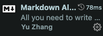
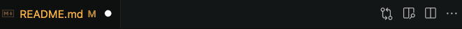

# Table Of Content
1. INSTALLATION
    - 1.1 python3
    - 1.2 sqlite
    - 1.3 Flask
    - 1.4 pipenv
2. REPOSITORY
    - 2.1 真似するrepository
    - 2.2 開発repositoryのdirectory tree
3. Summary of preliminary tasks
---
## 1. Installation
### 1.1 python3
```shell
python3 -V
# Python 3.11.4
# 仮想環境は3.8.7を採用する => 修正:3.11.4採用する、version切り替えめんどくさい；；
```

### 1.2 flask
`flask1.1.2`

### 1.3 sqlite
```shell
# 決めてない,Macならデフォルトで入っているはず, windowsは多分入ってない・・・一旦飛ばすか！
sqlite3 -version
# 3.39.5　バージョンに関してはどっちでもいいと思うけど、、問題あったらまたバージョン変更を行う
```

### 1.4 pipenv
- pipenvとは？
  - https://zenn.dev/nekoallergy/articles/py-env-pipenv01
  - 簡単に言うと・・・ローカル上のtarget directoryを仮想環境に変更する(pythonの環境)

- pipenvのインストール手順および仮想環境の作成(開発は仮想環境で行う)

    ```shell
    # 1.pipenvのインストール
    pip3 install pipenv

    pip3 list
    Package          Version
    ---------------- ---------
    certifi          2023.5.7
    distlib          0.3.6
    filelock         3.12.2
    pip              23.1.2
    pipenv           2023.6.18
    platformdirs     3.8.0
    protobuf         4.21.12
    setuptools       67.6.1
    virtualenv       20.23.1
    virtualenv-clone 0.5.7
    wheel            0.40.0

    # 2.directoryを作成
    mkdir gw_web_chat
    cd gw_web_chat

    # 3.git pull
    git remote add origin https://github.com/Zheng-yuhao/gw_web_chat.git
    git pull origin main

    # 3.1(optional)vscodeでファイルを書くかVimで書くか
    # 先にrepositoryをpullしたので、リポジトリー中にはrequirements.txtというファイルがあるはず、なければ自分で追加
    touch requirements.txt

    # 3.2(optional)requirementsの中身
    Flask==1.1.2

    # 4.仮想環境を生成(必ずgw_web_chat directoryにCD)
    pipenv --python 3.8.7

    # 5.仮想環境にパッケージをインストール
    pipenv install -r requirements.txt

    # 6.仮想環境に入る
    pipenv shell

    # 7.pip3 listでflaskが正常にインストールされたかどうかを確認
    pip3 list
    Package      Version
    ------------ -------
    click        8.1.3
    Flask        1.1.2
    itsdangerous 2.1.2
    Jinja2       3.1.2
    MarkupSafe   2.1.3
    pip          23.1.2
    setuptools   67.8.0
    Werkzeug     2.3.6
    wheel        0.40.0
    
    # 仮想環境から出る
    exit

    # 仮想環境へパッケージ追加
    pipenv install seaborn

    # 仮想環境を消す
    pipenv --rm
    ```
---

- [ ] 2023/06/26開発環境準備

---

## 2. Repository
RPの出し方について　→ [How to submit a pull request](https://qiita.com/siida36/items/880d92559af9bd245c34)

### 2.1 真似するrepository
https://github.com/TAKANARI1985/flaskchat/tree/main

> **注意事項**  
> **Procfile, requirements.txtをコピペする必要はない** 

### 2.2 開発repositoryのdirectory tree
```shell
.
├── Pipfile
├── Pipfile.lock
├── README.md
├── requirements.txt
├── static
│   └── css
└── templates
├── .gitignore

4 directories, 4 files
```

- `Pipfile`, `Pipfile.lock`は`.gitignore`に入ってる => gitにプッシュせん
- `20230626`現時点、`static/css`と`template` direcotryに何も入ってないのでローカルから`push`してもあげられない！
  - 各自feature branchを作成して`mkdir`コマンドで上のdirectory構造を作成してください！
  - feature branchの名前は割り当てられた機能で決める

## 3. Summary of preliminary tasks
- [Remote repository](https://github.com/Zheng-yuhao/gw_web_chat)から`pull`する
- `pipenv`で仮想環境を作る
- 仮想化環境で`Flask`が正常にインストールされている
- ローカル環境でdirectory treeを真似する/作成する
- 開発ツール
  - vscode
    - markdown extension install  
    インストール後このREADME.mdファイルを開き、  の右の点点点から左の2個目を押してpreview modeでこのREADMEファイルを見ることができます。

---
last edit:2023/06/26 by: @Zheng-yuhao  
*補足：トークンはMacOsのキーチェンのデータベースに含まれている。`command` + `space`でキーチェンを検索してからgithubを検索してください・・・出てくるはずです！絶対ファイルとかに記録しないでください、記録しようとしてもせめて単独のdirectoryの下に置いてください！*

---

2023/06/27:  
- [ ] :各々の担当部分を決める
- [ ] :ブランチの命名規則の決定
- [ ] :必要があればコードの解説